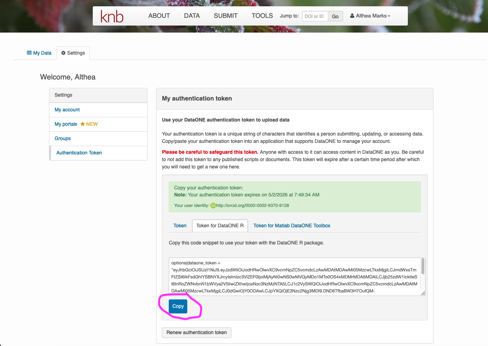

# Publish ARTIS Database on KNB Data Repository

## Table of Contents

- [Purpose](#purpose)
- [Who This Repo is For](#who-this-repo-is-for)
- [References and Resources](#references-and-resources)
- [Repo Installation](#repo-installation)
- [Workflow Instructions](#workflow-instructions)
- [Details](#details-on-using-emlassemblyline)

## Purpose

- Reproducible and versioned creation of EML metadata
- Version controled data dictionaries
- Reusable automated upload of database and metadata to KNB

ARTIS uses the The Knowledge Network for Biocomplexity [KNB](https://knb.ecoinformatics.org/) data repository to archive and publically distribute stable releases of the model codebase and database. Archiving, documenting and openly distributing ARTIS is a critical component in contributing to the larger open-science and reproducible science community. 

KNB is guided by [FAIR](https://doi.org/10.1038/sdata.2016.18) (findable, accessible, interoperable, resuble) principles of data sharing and preservation and issues unique DOIs (digital object identifier) to each data package and every version of the package for long term access, transparency, and informative citations. KNB is a member of [DataONE](https://www.dataone.org/) (Data Observation Network for Earth); a network of data repositories and KNB uses [EML](https://eml.ecoinformatics.org/) (Ecological Metadata Language) to document objects within a data packages and can be authored via the website GUI (graphical user interface) or through a series of R packages; the ARTIS workflow uses the [`EMLassemblyline`](https://github.com/EDIorg/EMLassemblyline) R package (EAL) combined with custom post-processing scripts to produce valid EML for the ARTIS parquet file collection.

## Who This Repo is For:

- Jessica Gephart (PI)
- Data scientist/manager responsible for maintaining the ARTIS model and database
- Anyone looking for a scripted example of writing EML and submitting to a DataOne data repository
- Anyone looking for an `EMLassemblyline` workaround for .parquet files

## References and Resources
- [KNB and ADC Data Team Training](https://nceas.github.io/datateam-training/training/) - For creating a data package to submit to KNB and editing of existing EML documentation. 
- [Instructions for the EML assembly line](https://nrm.dfg.ca.gov/FileHandler.ashx?DocumentID=197025) - Practical instructions for running the `EMLassemblyline` (EAL) workflow to author EML. 
- [DataOne R package documentation](https://dataoneorg.r-universe.dev/dataone) Check out the `Vignettes` particularly:
  - [DataONE Federation](https://dataoneorg.r-universe.dev/articles/dataone/v02-dataone-federation.html) for KNB Authentication Tokens and;
  - [Uploading Datasets to DataONE](https://dataoneorg.r-universe.dev/articles/dataone/v06-update-package.html) for an outline of the data package upload workflow. 

## Repo Installation

In your local IDE terminal: 

```bash
git clone https://github.com/Seafood-Globalization-Lab/knb-submit.git
```

## Workflow Instructions

### 1) Starting Assumptions

- ARTIS database is validated 
- Database is in cleaned final architecture on the Seafood Globalization Lab's UW NAS server

### 2) Set ARTIS file path in `.Renviron`

- The workflow reads the ARTIS parquet dataset from a local path set in your `.Renviron` file. Set this once per machine:

```r
usethis::edit_r_environ(scope = "project")
```

- Add this line to the `.Renviron` file that opens, replacing the path with your local ARTIS dataset location:

```bash
ARTIS_DB_PATH=/path/to/your/local/ARTIS/KNB/outputs
```

- Save and restart R.

> [!NOTE]
> This path setting will change slightly once ARTIS database files are stored on the Lab's UW NAS server. Will need to map external server files to local machine and insert that path into this workflow to point to the remote parquet files. 

### 3) Update `config.yml` 

This file contains all the model configuration parameters settings. Update the values for a new version of ARTIS. These values are used dynamically in the workflow scripts. 

> [!IMPORTANT]
> Pay attention to `dataone_coordinating_node:` and `dataone_member_node:` settings. See section [Point to correct KNB site/node](#7-point-to-correct-knb-sitenode) below for more details. 

### 4) Update `artis_dictionaries/` files (if needed)

These files need updating when any of the following occurs between ARTIS versions: 

- A new HS version is added - 
  - `artis_dictionary_hs_version.txt` add row
- A new column is added to existing table - 
  - `artis_dictionary_tbl_attributes.txt` add row
- A categorical variable is added or expanded -   
  - `artis_dictionary_tbl_attributes_catvars.txt` add rows for new domains
- A new table is added -
  - `artis_dictionary_tbl.txt` add row
  - `01_run_EMLassemblyline_for_artis_metadata_files.R`
    - `artis_gen_tbl_names` add table to vector
    - `templates` add regex tbl pattern to list
- Add a citation to the dataset - 
  - `artis_citations.bib` - add bibtex entry

> [!TIP]
> Open dictionary `.txt` files in a spreadsheet editor if edits are needed. The code in `01_run_EMLassemblyline_for_artis_metadata_files.R` reads in the text files in a way to remove invalid Excel added characters. 

### 5) Update persistent EMLassemblyline templates

The `artis_metadata_files/` directory is where the R package `EMLassemblyline` operates to write EML. Update files if needed: 

- `abstract.md`
- `additional_info.md`
- `keywords.txt`
- `methods.md`
- `personnel.txt`

> [!WARNING] 
> **Do not use special characters, symbols, or formatting.** EML only accepts Unicode plain text: UTF-8. URLs are acceptable. 

### 6) Generate EML metdatadata

- Run straight through `1_run_EMLassemblyline_for_artis_metadata_files.R` script. 
- Can inspect EML document written out `./artis_metadata_files/eml/ARTIS_v<x.x>_<prod_version>_EML.XML` with `EML::read_eml()` function.

### 7) Point to correct KNB site/node

> [!IMPORTANT]
> Before running `02_publish_ARTIS_data_on_KNB.R` it is essential to understand what KNB environment you want to push the data package (`dp` - data tables, EML metadata, and system metadata) to. You have two options: 
>
> - `"PROD"` - The KNB production site/node that is the offical public facing site for proper publishing. 
> - `"STAGING"` - The KNB test site/node that is an exact mirror of the production site, but intended for testing code and workflows.

> [!TIP]
> You can NOT transfer a datapackage from the staging site to the testing site.

- Update/check the `config.yml` parameters to correspond with the appropriate KNB node/site before running `02_publish_ARTIS_data_on_KNB.R`: 

  - `dataone_coordinating_node:`
  - `dataone_member_node:`

- Set your KNB node authentication in your IDE:

  1) Navigate to [KNB test/staging site](https://dev.nceas.ucsb.edu/) OR [KNB production site](https://knb.ecoinformatics.org/) (may need to use a different browser)
  2) Login with your ORCiD to access your profile.
     - serves as your ID. Create one here [ORCiD](https://orcid.org/)
  3) Navigate to your profile --> settings --> authentication Token --> "Token for DataONE R" (_Highlighted in pink in screenshot below_)
  4) Copy the string to your clipboad. Paste and call in your console to set temporary access token

> [!Tip]
> If you having problems, click small red link on login popup window and adjust browser settings)
Check out [dataone r package vignette](https://cran.r-project.org/web/packages/dataone/vignettes/v02-dataone-federation.html) for more detailed instructions. Note the vignette instructions are for the productions site, we need a stagging site token



### 8) Push Datapackage to KNB 

- Run `02_publish_ARTIS_data_on_KNB.R`
  - Final `dp` datapackage object created in line 124
  - Test `dp` lines 128 - 190
  - Upload to KNB lines 191 - 201

### 9) Inspect KNB record

- `./03_inspect_KNB_EML.R` has code to point to a data record on KNB. Can be used to inspect a record on the test or production site depending on how the `config.yml` is set. 
- You can also inspect the datapackage on the corresponding websites in your browser:
  - [KNB test/staging site](https://dev.nceas.ucsb.edu/)
  - [KNB production site](https://knb.ecoinformatics.org/)

> [!Tip] 
> Will need to get separate authentication tolkens for each site. 

### 10) Fixing your datapackage on KNB (optional)

#### Edit EML metadata

- Make your changes to the appropriate code and files in the repo files. 
- Regenerate EML file locally by rerunning
`01_run_EMLassemblyline_for_artis_metadata_files.R`
- In `03_inspect_KNB_EML.R` - Replace `D1Client` arguement values to point to the dataset on the appropriate KNB environment
- In `03_inspect_KNB_EML.R` - Replace `resourcemapId` value with the latest identifier on the corresponding KNB site/node website record of the dataset. (_Highlighted with orange in screenshot below_)
- Step through `03_inspect_KNB_EML.R` to pull down datapackage (without data) and replace the EML object and push back up to KNB. 

#### Edit datapackage structure or Sysmetadata

> [!WARNING]
> This is less likely scenario and requires more attention when steping through the workflow scripts. There isn't a top-to-bottom script to handle this situation. The datapackage needs to be rebuilt and then available in the global environement when running a `replaceMember()` function in `03_inspect_KNB_EML`. 
>
> Consult the [KNB and ADC Data Team Training](https://nceas.github.io/datateam-training/training/) and/or contact the KNB curation team. 

### 11) Publish with DOI

- Wait for entire datapackage to upload to the KNB production site/node AND index the datapackage (backend system to recognize the new datapackage). This may take a bit. 
- Inspect GUI representation of the EML on the website
- Click button "Publish with DOI" at the middle right of the dataset webpage (_Highlighted with pink in screenshot below_).


### 12) Tag repo version

- Create a git tag for the repo used to publish the ARTIS database on KNB. This creates a "bookmark" in the code history and documents our reproducable workflow. Example tag name: `KNB-ARTIS-release/v1.2_FAO`

```zsh
git tag KNB-ARTIS-release/v<model_version>_<prod_type>
```

```zsh
git push origin KNB-ARTIS-release/v1.2_FAO
```

---

## Details on using `EMLassemblyline`

This section documents details of using this repo to author EML and publish on KNB. 

### Details: Relevant File Architecture

```
artis-eml-knb-submit/
├── artis_dictionaries/ 
│   ├── artis_citations.bib                        # ⭐ Citations for database (long-lived)
│   ├── artis_dictionary_tbl_attributes.txt        # ⭐ Attribute definitions (long-lived)
│   ├── artis_dictionary_tbl_attributes_catvars.txt # ⭐ Categorical variable definitions (long-lived)
│   ├── artis_dictionary_hs_version.txt            # ⭐ HS version definitions (long-lived)
│   ├── artis_dictionary_tbl.txt                   # ⭐ Table-level descriptions (long-lived)
├── artis_metadata_files/
│   ├── data_objects/                              # Representative .csv files (auto-generated)
│   ├── eml/                                       # Output EML .xml files land here
│   └── metadata_templates/
│       ├── abstract.md                            # ⭐ Dataset abstract (update each release)
│       ├── methods.md                             # ⭐ Dataset methods (update if needed)
│       ├── additional_info.md                     # ⭐ Additional dataset info
│       ├── keywords.txt                           # ⭐ Dataset keywords
│       ├── personnel.txt                          # ⭐ Creator/contact/PI info (update each release)
│       ├── intellectual_rights.txt                # License (rarely needs editing)
│       ├── attributes_*.txt                       # Auto-generated — do NOT manually edit
│       └── catvars_*.txt                          # Auto-generated — do NOT manually edit
├── functions/
│   └── ARTIS_EAL_helper_functions.R               # Helper functions sourced by run script
├── tests/
│   └── test-artis-eml-validation.R               # Validation script called in workflow
├── 01_run_EMLassemblyline_for_artis_metadata_files.R   # Workflow script to run
├── 02_publish_ARTIS_data_on_KNB.R                 # Workflow script to run
├── 03_inspect_KNB_EML.R                           # Optional workflow script to run
└── config.yml                                     # ⭐ Settings used by workflow scripts

```

> ⭐ = files you may need to update for a new release. All other files are either auto-generated or rarely change.

### Details: `abstract.md`

Open in Positron or Rstudio (not Excel or text editor) and update the temporal coverage, species counts, or any other release-specific language.

> [!WARNING]
> Do NOT use LaTeX syntax in this markdown document. Equations must use a unicode syntax. 

### Details: `personnel.txt`

Open in a spreadsheet editor and verify or update author/contact information.

Key rules for this file:

- **At least one `creator` and one `contact` must be listed** — these are required by EML
- **`userId`** must be the 16-digit ORCiD number only, formatted as `XXXX-XXXX-XXXX-XXXX` — not the full URL
- **Valid `role` values** from the EAL documentation: `creator`, `contact`, `PI`, `metadataProvider`. Any other string is also accepted and will appear as an associated party. Note these are not `EML` valid values, EAL has its own set that gets translated in `make_eml()`.
- If a person has more than one role, duplicate their row with the second role. One row per role.

### Details: ARTIS data dictionaries

See Section above [4) Update artis_dictionaries/ files (if needed)](#4-update-artis_dictionaries-files-if-needed)

Valid values for key columns in `artis_dictionary_tbl_attributes.txt`:

| Column | Valid values |
|---|---|
| `class` | `numeric`, `categorical`, `character`, `Date` |
| `unit` | Required when `class == "numeric"`. Use `dimensionless` if no units apply. Must be blank for non-numeric. Run `EMLassemblyline::view_unit_dictionary()` to find valid unit names. |
| `dateTimeFormatString` | Required when `class == "Date"`. Use format codes: `YYYY`, `MM`, `DD`, `hh`, `mm`, `ss`. Must be blank for non-Date. |
| `missingValueCode` | One value per attribute (e.g. `NA`). |

### Details: `01_run_EMLassemblyline_for_artis_metadata_files.R`

The script will:

1. Delete stale `attributes_*.txt` and `catvars_*.txt` template files
2. Read in the ARTIS data dictionaries with encoding sanitization
3. Convert representative parquet files to `.csv` (if `convert_parquets == "yes"`)
4. Run `EMLassemblyline` template functions to generate attribute and categorical variable templates
5. Join your dictionary definitions into the templates
6. Call `EMLassemblyline::make_eml()` to produce an initial EML `.xml` file describing the 8 ARTIS representative `.csv` files of the general table types.
7. Post-process the EML: the 8 representative `.csv` `<dataTable>` elements are replaced with `<dataTable>` elements describing the full collection of `n` parquet files. Each parquet file is matched to its ARTIS table type (e.g. `consumption`, `trade`, `reference_hs6`) and cloned from the corresponding representative `<dataTable>` template — preserving the full `<attributeList>` column definitions. Only the `<physical>` (file name, size, format), `<entityName>`, and `<entityDescription>` fields are updated to reflect each individual parquet file. This means the single representative `consumption` and `trade` templates are each stamped across all of their respective partitioned parquet files (split by HS version and year), while each reference table template is cloned once.
8. Write the final EML to `metadata-files/eml/ARTIS_v1.2_FAO_parquet.xml`
9. Validate the EML — you should see `[1] TRUE` with no errors

If validation fails, the error message will point to the invalid section.

### Details: Test script to check dictionaries and templates

Run automatically in `01_run_EMLassemblyline_for_artis_metadata_files.R`

These are **not** a substitute for formal EML validation (which runs automatically at the end of the main script) — they are a supplementary check designed specifically for the ARTIS workflow. Because `EMLassemblyline` uses its own set of valid values that differ from raw EML schema values, these tests verify that the long-lived ARTIS data dictionaries stay aligned with what `EMLassemblyline` expects when it reads the generated `attributes_*.txt` and `catvars_*.txt` template files.

This is particularly useful to run after editing any of the dictionary files before re-running the main script:

```r
test_results <- testthat::test_file(path = "./tests/test_artis_dictionaries_valid.R") %>% 
  as.data.frame()
```

The checks confirm:

- All `class` values in the ARTIS dictionaries and generated attribute templates are valid EAL values (`numeric`, `categorical`, `character`, `Date`)
- Numeric attributes have units; non-numeric attributes do not
- `Date` attributes have a `dateTimeFormatString`; non-Date attributes do not
- All `attributeDefinition` and categorical `definition` fields are non-empty
- No non-UTF-8 encoding artifacts remain in dictionary character columns
- `personnel.txt` contains at least one `creator`, `contact`, `PI`, and `metadataProvider`
- All ORCiD `userId` values are formatted as `XXXX-XXXX-XXXX-XXXX`

Fix any failures in the source dictionary files and re-run the main script before proceeding to publish.

## Table of Contents

- [Purpose](#purpose)
- [Who This Repo is For](#who-this-repo-is-for)
- [References and Resources](#references-and-resources)
- [Repo Installation](#repo-installation)
- [Workflow Instructions](#workflow-instructions)
- [Details on using `EMLassemblyline`](#details-on-using-emlassemblyline)
